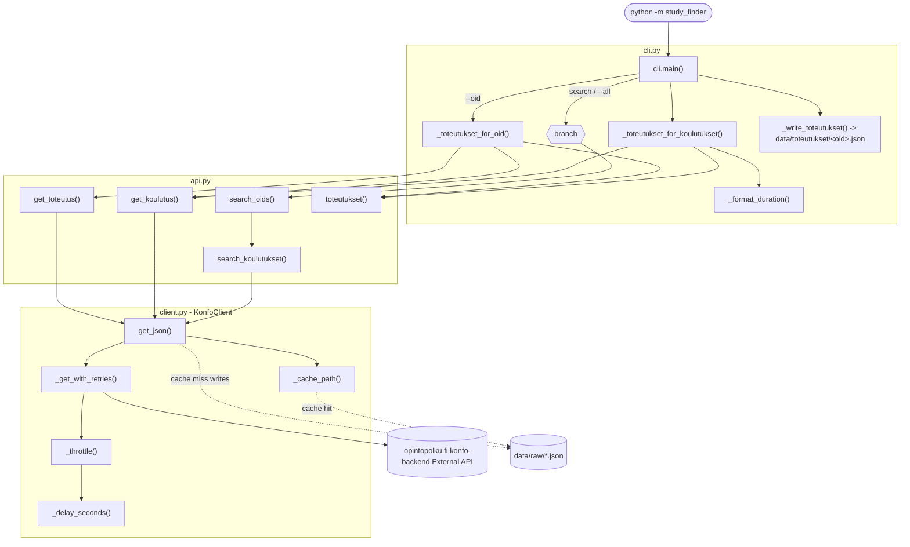

# Architecture

How the program works and how the functions call each other. Each module has one
job; data flows **search/fetch koulutus (api) → cache (client) → pull out
embedded toteutukset → write one raw JSON file per toteutus (cli)**. There is no
normalization step — the saved JSON is the raw API response.

## How to read it

- **`cli.main`** parses args, builds a `KonfoClient`, then collects toteutus
  objects — either for one `--oid` (`_toteutukset_for_oid`: a toteutus oid yields
  itself, a koulutus oid yields all its toteutukset) or across a paginated search
  (`search_oids` → `_toteutukset_for_koulutukset`) — and writes one
  `<oid>.json` per toteutus via `_write_toteutukset`.
- **`api.toteutukset`** pulls the embedded toteutus objects out of a koulutus
  fetched with `?toteutukset=true`, so no separate per-toteutus calls are needed.
  `_toteutukset_with_parent` then attaches the parent koulutus to each toteutus
  (under a `koulutus` key) so degree-level info (e.g. `koulutusala`) is kept.
- **`api.*`** are thin wrappers that all funnel into **`client.get_json`**, which
  checks the disk cache (`_cache_path`) first and only on a miss hits the network
  through `_get_with_retries` → `_throttle` → `_delay_seconds` (the random 2–10s
  wait). Cache hits skip the network and the delay entirely.

See [`field-map.md`](field-map.md) for what lives where in the saved JSON.
